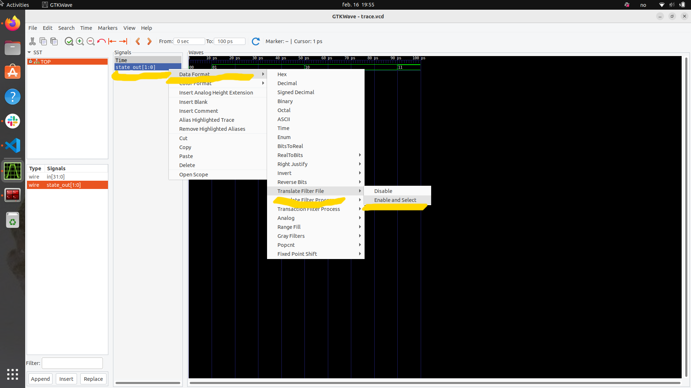
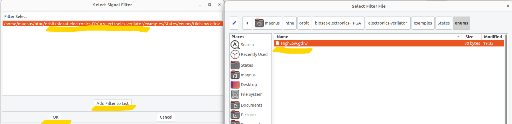

# How to add states to waveform

1. In your design (.sv file), create an enum in the same way as in the `States.sv` file. Remember the `/* verilator public */` comment, as `Verilator` will pick up on this and generate a C++ equivalent enum for you.
2. Run the `enumparse.py` Python script. This parses the C++ enum and generates a file that adheres to gtkwave's configuration files. The script will output one file per enum in your code under the `enums` folder. (In this project, the python script is automatically run with `make`.)
3. Select the signal you want to correlate with your enums. Make sure it is *blue*! `Data format` -> `Translate Filter File` -> `Enable and Select`. See Figure 1.
4. `Add filter to list` -> Add correct `.gtkw` file -> Make sure it is *blue* -> `Ok`. See Figure 2.
5. Once this is done, you can save the configuration (CTRL + S) and reuse it later (`gtkwave <tracefile> -a <config file>`). It is fine to track the config file on git if the signals included are somewhat stable.

Figure 1:

Figure 2:

